# PataAmiga

> Plataforma web de gestão para ONGs de resgate e adoção de animais.

<div align="justify">
O <b>PataAmiga</b> é uma plataforma web desenvolvida para centralizar e otimizar a gestão de ONGs dedicadas ao resgate e adoção de animais. O sistema acompanha o ciclo de vida completo de cada animal — desde o resgate inicial, passando pelos cuidados veterinários, até a adoção responsável — integrando todos os atores envolvidos: adotantes, voluntários, veterinários, coordenadores e doadores em uma única solução.
</div>

---

## Status do Projeto

[](https://github.com/RenatoDNS/PataAmiga/releases)


[](#licença)

---

## Índice

- [Links Úteis](#links-úteis)
- [Sobre o Projeto](#sobre-o-projeto)
- [Funcionalidades Principais](#funcionalidades-principais)
- [Tecnologias Utilizadas](#tecnologias-utilizadas)
- [2. Modelos de Usuário e Requisitos](#2-modelos-de-usuário-e-requisitos)
  - [2.1 Descrição de Atores](#21-descrição-de-atores)
  - [2.2 Modelo de Casos de Uso](#22-modelo-de-casos-de-uso)
  - [2.3 Diagramas de Sequência do Sistema e Contratos de Operações](#23-diagramas-de-sequência-do-sistema-e-contratos-de-operações)
- [3. Modelos de Projeto](#3-modelos-de-projeto)
  - [3.1 Arquitetura (C4 Model)](#31-arquitetura-c4-model)
  - [3.2 Diagrama de Componentes e Implantação](#32-diagrama-de-componentes-e-implantação)
  - [3.3 Diagrama de Classes](#33-diagrama-de-classes)
  - [3.4 Diagramas de Sequência](#34-diagramas-de-sequência)
  - [3.5 Diagramas de Comunicação](#35-diagramas-de-comunicação)
  - [3.6 Diagrama de Estados](#36-diagrama-de-estados)
- [4. Modelos de Dados](#4-modelos-de-dados)
- [Instalação e Execução](#instalação-e-execução)
- [Estrutura de Pastas](#estrutura-de-pastas)
- [Documentações Utilizadas](#documentações-utilizadas)
- [Autores](#autores)
- [Agradecimentos](#agradecimentos)
- [Licença](#licença)

---

## Links Úteis

- 📖 **PlantUML:** [Documentação Oficial](https://plantuml.com)
- 📖 **Spring Boot:** [Referência](https://docs.spring.io/spring-boot/docs/current/reference/html/)
- 📖 **Angular:** [Documentação Oficial](https://angular.dev)
- 📖 **Conventional Commits:** [Guia de Mensagens](https://www.conventionalcommits.org/en/v1.0.0/)

---

## Sobre o Projeto

ONGs de resgate e adoção de animais frequentemente operam com processos manuais e descentralizados — planilhas, grupos de WhatsApp e cadernos físicos — o que dificulta o controle, compromete a rastreabilidade e limita a capacidade de atendimento.

O **PataAmiga** resolve esse problema oferecendo uma plataforma centralizada que:

- Registra e acompanha cada animal desde o resgate até a adoção
- Organiza o histórico veterinário completo de cada animal
- Gerencia o processo de adoção com etapas formalizadas
- Conecta adotantes a animais disponíveis com busca por perfil
- Permite que doadores acompanhem o impacto de suas contribuições
- Fornece ao coordenador da ONG visibilidade operacional e relatórios gerenciais

---

> **Contexto Acadêmico**
>
> Este projeto é o **Trabalho 2** da disciplina de **Projeto de Software** da **PUC Minas** (Prof. Dr. João Paulo Aramuni). O trabalho solicita a **documentação arquitetural completa** de um sistema de software — incluindo especificação de requisitos, modelagem UML com PlantUML, definição de tecnologias e descrição da arquitetura.
>
> **Este repositório contém exclusivamente documentação.** Não há código-fonte implementado. A estrutura de pastas apresentada na seção [Estrutura de Pastas](#estrutura-de-pastas) representa como o projeto seria organizado caso fosse desenvolvido, servindo como artefato de projeto de software.

---

## Funcionalidades Principais

- **Gestão de Animais:** Cadastro completo com foto, espécie, raça, idade, porte e acompanhamento de status ao longo do ciclo de vida
- **Prontuário Veterinário:** Registro de consultas, vacinas, procedimentos cirúrgicos e laudos de liberação para adoção
- **Processo de Adoção:** Fluxo formalizado — solicitação → entrevista → aprovação → contrato → acompanhamento pós-adoção
- **Busca e Filtragem:** Adotantes podem filtrar animais por espécie, porte, idade, sexo e localidade
- **Gestão de Voluntários:** Cadastro, disponibilidade, alocação de tarefas e histórico de atividades
- **Gestão de Doações:** Registro de doadores, histórico de doações, comprovantes e relatório de destinação
- **Painel do Coordenador:** Visão gerencial com indicadores de animais, adoções e recursos em tempo real
- **Notificações:** Alertas para adotantes sobre atualização de status e para voluntários sobre agendamentos

---

## Tecnologias Utilizadas

### Frontend

- **Framework:** Angular 17
- **Linguagem:** TypeScript
- **Estilização:** Angular Material / Tailwind CSS
- **Gerenciamento de Estado:** NgRx / Angular Signals
- **HTTP:** Angular HttpClient

### Backend

- **Linguagem:** Java 21
- **Framework:** Spring Boot 3.x
- **Banco de Dados:** PostgreSQL 16
- **ORM:** Hibernate / JPA
- **Autenticação:** JWT + Spring Security
- **Build:** Maven

### Infraestrutura

- **Containerização:** Docker + Docker Compose
- **CI/CD:** GitHub Actions

---

## 2. Modelos de Usuário e Requisitos

### 2.1 Descrição de Atores

| Ator | Tipo | Responsabilidades |
|------|------|-------------------|
| **Adotante** | Externo / Primário | Buscar animais disponíveis, submeter solicitação de adoção, acompanhar o processo e registrar pós-adoção |
| **Voluntário** | Interno / Operacional | Registrar animais resgatados, agendar atendimentos veterinários, atualizar status e apoiar eventos |
| **Veterinário** | Interno / Especialista | Emitir laudos clínicos, registrar prontuários, aplicar vacinas e procedimentos, liberar animais para adoção |
| **Coordenador da ONG** | Interno / Administrativo | Gerenciar equipe, aprovar ou rejeitar adoções, controlar recursos, emitir relatórios gerenciais |
| **Doador** | Externo / Suporte | Realizar doações pontuais ou recorrentes, acompanhar uso dos recursos e visualizar relatórios de impacto |

---

### 2.2 Modelo de Casos de Uso

> Visão geral das interações entre os 5 atores e as funcionalidades do sistema. Cada caso de uso recebe um ID (`UC-NN`) usado como referência cruzada nas demais seções.

#### Lista de Casos de Uso

Os 14 casos de uso estão agrupados em 5 pacotes funcionais.

| ID | Caso de Uso | Ator(es) Primário(s) | Pacote |
|----|-------------|---------------------|--------|
| **UC-01** | Solicitar Adoção | Adotante | Adoção |
| **UC-02** | Registrar Animal Resgatado | Voluntário | Gestão de Animais |
| **UC-03** | Registrar Atendimento Veterinário | Veterinário | Atendimento Veterinário |
| **UC-04** | Buscar Animal Disponível | Adotante | Adoção |
| **UC-05** | Acompanhar Processo de Adoção | Adotante | Adoção |
| **UC-06** | Registrar Pós-Adoção | Adotante | Adoção |
| **UC-07** | Atualizar Status do Animal | Voluntário | Gestão de Animais |
| **UC-08** | Agendar Atendimento Veterinário | Voluntário | Gestão de Animais |
| **UC-09** | Emitir Laudo de Liberação para Adoção | Veterinário | Atendimento Veterinário |
| **UC-10** | Aprovar/Rejeitar Adoção | Coordenador da ONG | Adoção |
| **UC-11** | Gerenciar Voluntários | Coordenador da ONG | Administração |
| **UC-12** | Emitir Relatórios Gerenciais | Coordenador da ONG | Administração |
| **UC-13** | Realizar Doação | Doador | Doações |
| **UC-14** | Acompanhar Destinação das Doações | Doador | Doações |

#### Relacionamentos entre Casos de Uso

| Relacionamento | Descrição |
|---|---|
| `UC-03` **«include»** `UC-07` | Todo atendimento veterinário registra uma transição de status (ex.: `RESGATADO` → `EM_TRATAMENTO`). |
| `UC-09` **«include»** `UC-07` | A emissão do laudo de liberação move o animal para `DISPONIVEL`. |
| `UC-10` **«include»** `UC-07` | A aprovação move para `EM_PROCESSO_ADOCAO`/`ADOTADO`; a rejeição mantém em `DISPONIVEL`. |

| 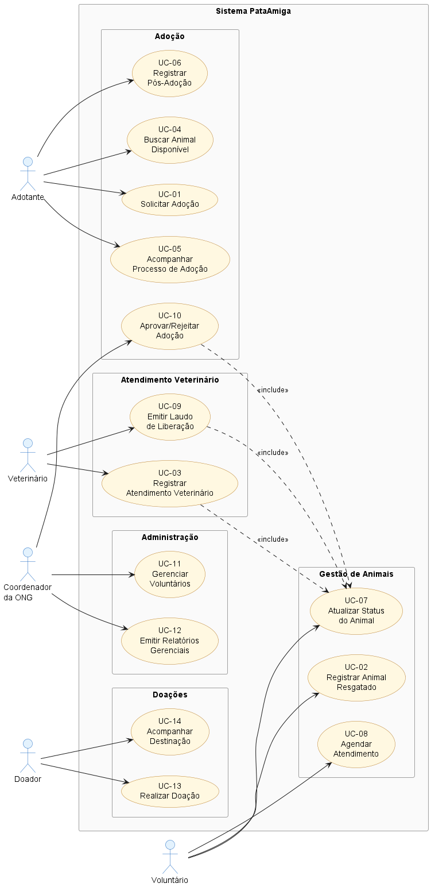 |
| :---: |
| **Figura 1** — Diagrama de Casos de Uso do PataAmiga |

Fonte PlantUML: [`docs/diagrams/puml/01-caso-de-uso.puml`](docs/diagrams/puml/01-caso-de-uso.puml)

---

### 2.3 Diagramas de Sequência do Sistema e Contratos de Operações

> Diagramas de Sequência do Sistema (SSD) — visão **caixa-preta** das três operações de sistema escolhidas. Cada SSD origina um **contrato de operação** com pré-condições e pós-condições.

| UC-01 Solicitar Adoção | UC-02 Registrar Animal | UC-03 Registrar Atendimento |
| :---: | :---: | :---: |
| 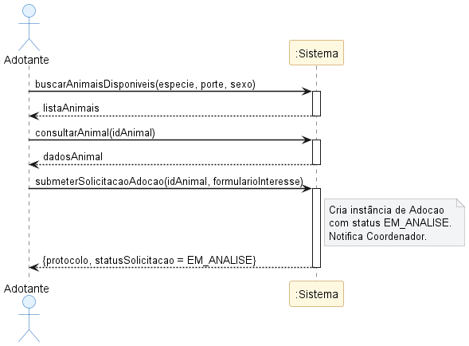 | 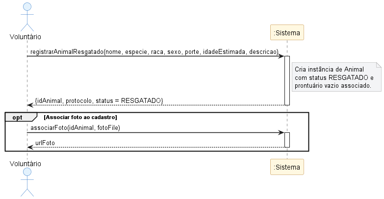 | 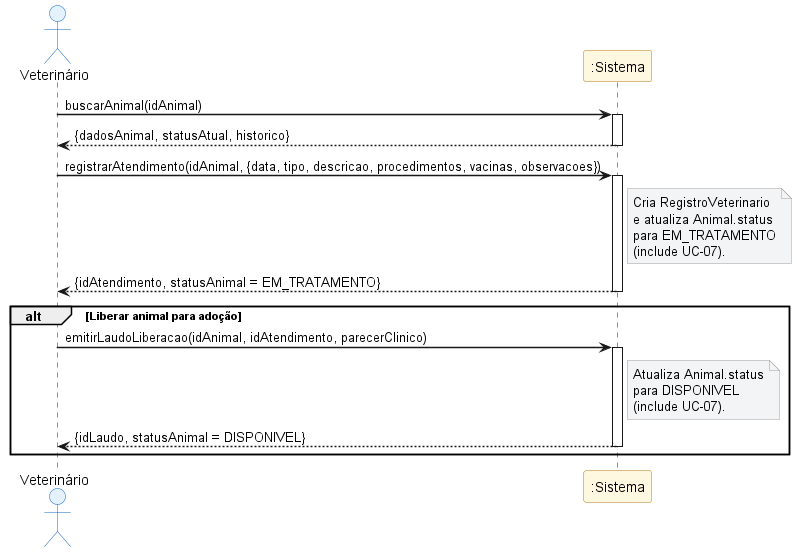 |
| **Figura 2** — SSD UC-01 Solicitar Adoção | **Figura 3** — SSD UC-02 Registrar Animal | **Figura 4** — SSD UC-03 Registrar Atendimento |

Fontes PlantUML:
- [`docs/diagrams/puml/02-ssd-solicitar-adocao.puml`](docs/diagrams/puml/02-ssd-solicitar-adocao.puml)
- [`docs/diagrams/puml/03-ssd-registrar-animal.puml`](docs/diagrams/puml/03-ssd-registrar-animal.puml)
- [`docs/diagrams/puml/04-ssd-registrar-atendimento.puml`](docs/diagrams/puml/04-ssd-registrar-atendimento.puml)

#### Contratos de Operação

> Um contrato por operação de sistema principal, derivado do respectivo SSD.

---

**CO-01 — `submeterSolicitacaoAdocao`**

| Campo | Descrição |
|---|---|
| **Operação** | `submeterSolicitacaoAdocao(idAnimal: Long, formularioInteresse: FormularioAdocaoDTO)` |
| **Referências cruzadas** | UC-01 Solicitar Adoção |
| **Pré-condições** | Animal com `id = idAnimal` existe e possui `status = DISPONIVEL`. Adotante autenticado no sistema. |
| **Pós-condições** | Instância de `Adocao` criada com `status = EM_ANALISE` e associada ao `Animal` e ao `PerfilAdotante`. `Animal.status` mantido como `DISPONIVEL`. Notificação enviada ao Coordenador. |

---

**CO-02 — `registrarAnimalResgatado`**

| Campo | Descrição |
|---|---|
| **Operação** | `registrarAnimalResgatado(dados: AnimalRequestDTO)` |
| **Referências cruzadas** | UC-02 Registrar Animal Resgatado |
| **Pré-condições** | Voluntário autenticado. `dados.nome` e `dados.especie` não vazios. |
| **Pós-condições** | Instância de `Animal` criada com `status = RESGATADO` e `id` gerado. `RegistroVeterinario` inicial (vazio) associado ao animal. |

---

**CO-03 — `registrarAtendimento`**

| Campo | Descrição |
|---|---|
| **Operação** | `registrarAtendimento(idAnimal: Long, dados: AtendimentoRequestDTO)` |
| **Referências cruzadas** | UC-03 Registrar Atendimento Veterinário; UC-07 Atualizar Status do Animal (include) |
| **Pré-condições** | Animal com `id = idAnimal` existe. Veterinário autenticado. `dados.descricao` não vazio. |
| **Pós-condições** | Instância de `RegistroVeterinario` criada e associada ao `Animal`. `Animal.status` atualizado para `EM_TRATAMENTO` caso status anterior fosse `RESGATADO`. |

---

## 3. Modelos de Projeto

### 3.1 Arquitetura (C4 Model)

O PataAmiga adota uma arquitetura **monolítica modular em camadas**, adequada para o porte de uma ONG de pequeno e médio porte. A arquitetura é apresentada em três níveis do **C4 Model**: contexto, containers e componentes.

**Pacotes do backend (`br.pucminas.pataamiga`):**

```
controller/          — @RestController, mapeamento de rotas REST
service/             — @Service, regras de negócio
repository/          — interfaces Spring Data JPA (@Repository)
model/               — entidades JPA (@Entity, @Table)
dto/
  ├── request/       — payloads de entrada (AnimalRequestDTO…)
  └── response/      — payloads de saída  (AnimalResponseDTO…)
mapper/              — conversão DTO ↔ Entity via MapStruct (@Mapper)
exception/           — exceptions customizadas + @RestControllerAdvice
config/              — SecurityConfig, OpenApiConfig, CorsConfig
security/            — JwtFilter, JwtUtil, UserDetailsServiceImpl
```

**Padrões adotados:** Repository Pattern, Service Layer, DTO (request/response), Mapper (MapStruct), Global Exception Handling, Spring Security com RBAC por perfil de ator.

#### C4 Nível 1 — Contexto

| 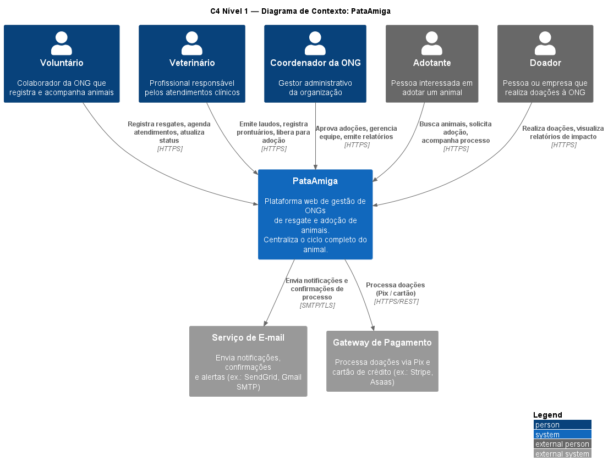 |
| :---: |
| **Figura 5** — C4 Nível 1: Diagrama de Contexto do PataAmiga |

Fonte PlantUML: [`docs/diagrams/puml/05-c4-contexto.puml`](docs/diagrams/puml/05-c4-contexto.puml)

#### C4 Nível 2 — Containers

| 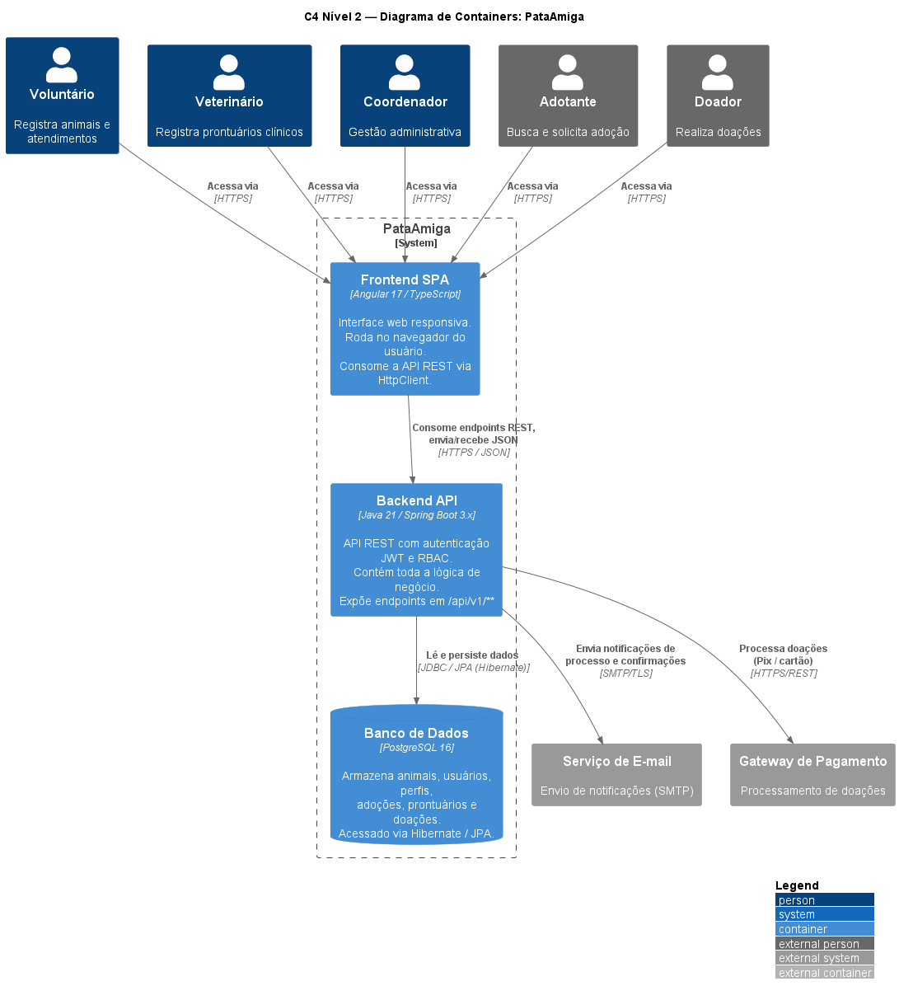 |
| :---: |
| **Figura 6** — C4 Nível 2: Diagrama de Containers do PataAmiga |

Fonte PlantUML: [`docs/diagrams/puml/06-c4-containers.puml`](docs/diagrams/puml/06-c4-containers.puml)

---

### 3.2 Diagrama de Componentes e Implantação

> O **diagrama de componentes** é o **C4 Nível 3**, detalhando os componentes internos do backend. O **diagrama de implantação** mostra onde cada container é alocado na infraestrutura Docker.

#### Diagrama de Componentes (C4 Nível 3)

| 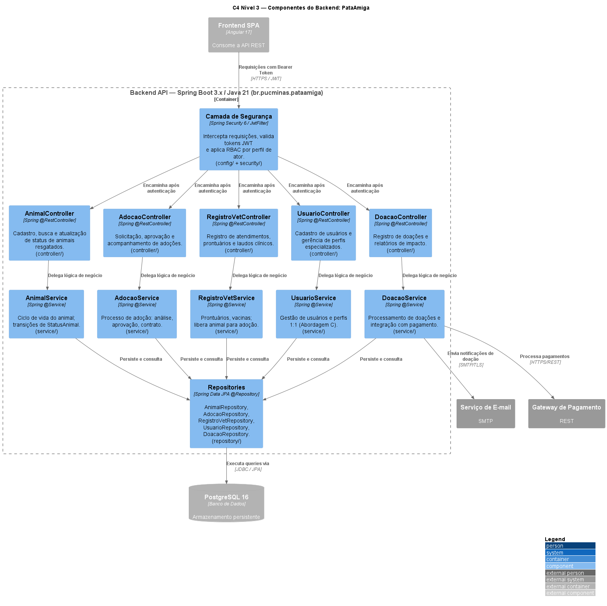 |
| :---: |
| **Figura 7** — C4 Nível 3: Componentes do Backend PataAmiga |

Fonte PlantUML: [`docs/diagrams/puml/07-c4-componentes.puml`](docs/diagrams/puml/07-c4-componentes.puml)

#### Diagrama de Implantação

A implantação é orquestrada por **Docker Compose** (arquivo `docker-compose.yml` na raiz do projeto). Três containers compartilham a rede bridge `pataamiga-net` em um host Linux com Docker Engine, e dois sistemas externos são consumidos pela API:

| Container | Imagem Docker | Portas (host:container) | Responsabilidade | Volume |
|---|---|:---:|---|---|
| `pataamiga-frontend` | `nginx:alpine` | `4200:80` | Servir o build estático do SPA Angular 17 | — |
| `pataamiga-backend` | `eclipse-temurin:21-jre` | `8080:8080` | API REST Spring Boot 3.x (`/api/v1/**`) com JWT e RBAC | — |
| `pataamiga-db` | `postgres:16-alpine` | `5432:5432` | Banco PostgreSQL com schema `pataamiga` | `pataamiga-pgdata` |

| Sistema externo | Protocolo | Uso |
|---|---|---|
| Serviço de E-mail (SMTP) | SMTP/TLS | Notificações de adoção e confirmações de doação |
| Gateway de Pagamento | HTTPS/REST | Processamento de doações via Pix e cartão |

**Ordem de inicialização:** `pataamiga-db` (com `healthcheck`) → `pataamiga-backend` (`depends_on: db`) → `pataamiga-frontend` (`depends_on: backend`).

| 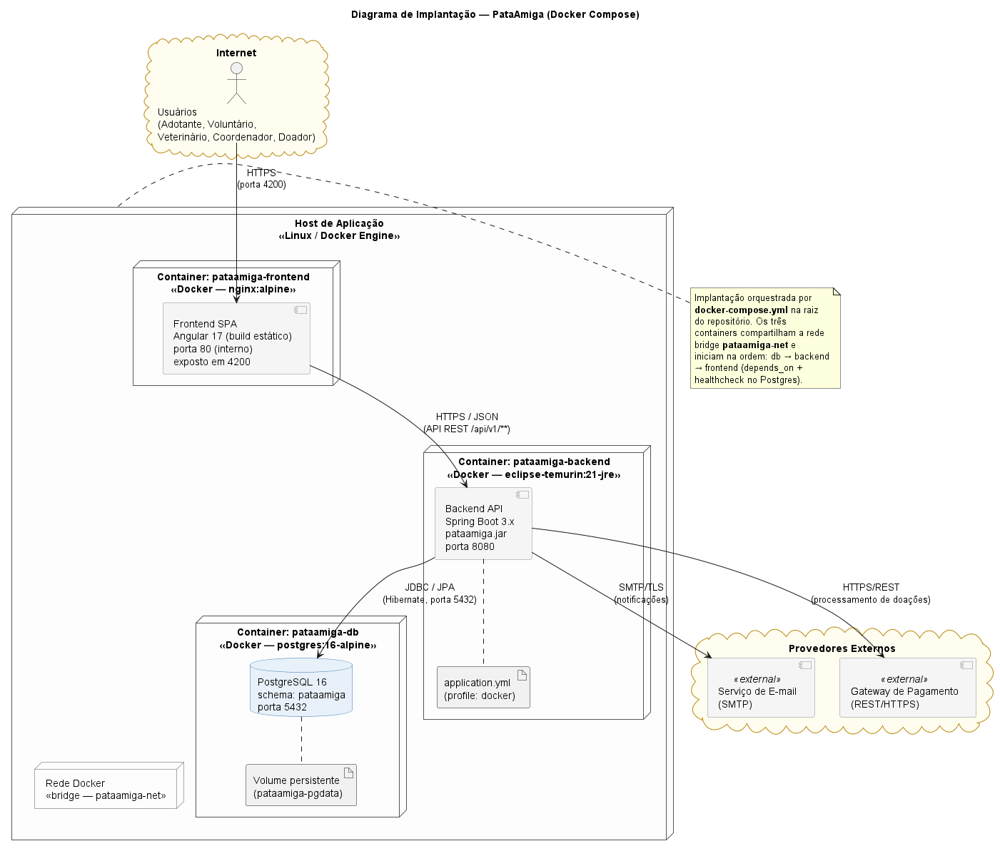 |
| :---: |
| **Figura 8** — Diagrama de Implantação do PataAmiga (Docker Compose) |

Fonte PlantUML: [`docs/diagrams/puml/08-implantacao.puml`](docs/diagrams/puml/08-implantacao.puml)

---

### 3.3 Diagrama de Classes

> Modelo de domínio com entidades, atributos, métodos e relacionamentos.

O modelo adota a **Abordagem C** para usuários: uma entidade `Usuario` central concentra os dados pessoais (nome, e-mail, CPF, telefone, endereço, senha), e cinco perfis especializados — `PerfilAdotante`, `PerfilDoador`, `PerfilVoluntario`, `PerfilVeterinario` e `PerfilCoordenador` — estendem `Usuario` por composição **1:1 opcional**. Uma mesma pessoa pode acumular qualquer combinação de papéis sem duplicar dados de cadastro.

#### Principais classes do domínio

| Classe | Tipo | Papel no modelo |
|---|---|---|
| `Usuario` | Entidade central | Identidade comum a todos os atores; responsável por autenticação |
| `Perfil` (abstrata) | Superclasse | Define `ativo`, `dataAtivacao` e operações genéricas dos perfis |
| `PerfilAdotante` / `PerfilDoador` / `PerfilVoluntario` / `PerfilVeterinario` / `PerfilCoordenador` | Perfis 1:1 | Especializam `Usuario` com atributos e operações específicas de cada papel |
| `Animal` | Entidade central do negócio | Estado controlado pelo enum `StatusAnimal`; relaciona-se com prontuários e adoções |
| `RegistroVeterinario` | Entidade | Cada atendimento veterinário registrado; `liberaParaAdocao` aciona transição de status |
| `Adocao` | Entidade | Processo de adoção com ciclo de vida `EM_ANALISE → … → CONCLUIDA`/`REJEITADA` |
| `Doacao` | Entidade | Aporte pontual ou recorrente associado a um `PerfilDoador` |
| `Relatorio` | Entidade | Saída agregada gerada por um `PerfilCoordenador` |
| `StatusAnimal`, `StatusAdocao`, `TipoDoacao`, `TipoRelatorio`, `TipoAtendimento`, `Especie`, `Sexo`, `Porte` | Enums | Estados e classificadores do domínio |

| 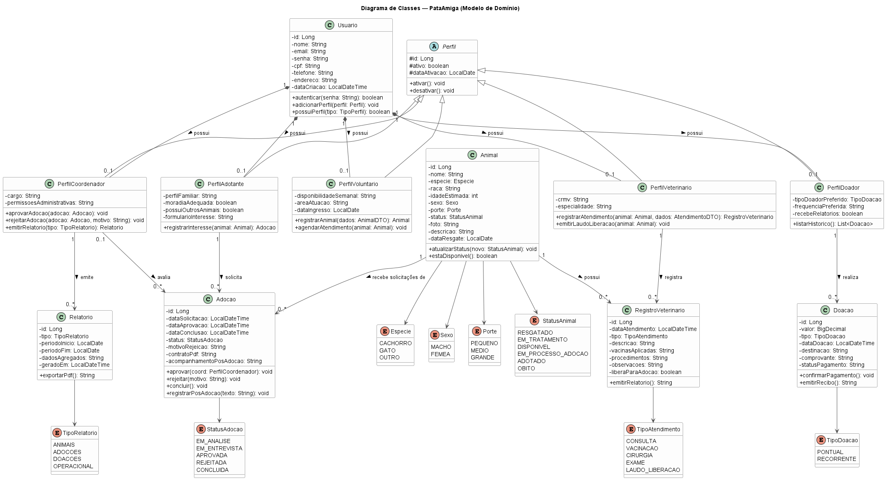 |
| :---: |
| **Figura 9** — Diagrama de Classes do Modelo de Domínio do PataAmiga |

Fonte PlantUML: [`docs/diagrams/puml/09-classes.puml`](docs/diagrams/puml/09-classes.puml)

---

### 3.4 Diagramas de Sequência

> Realização interna (**caixa-branca**) dos três casos de uso escolhidos. Cada diagrama atravessa as camadas da arquitetura — `SPA Angular` → `JwtFilter` → `Controller` → `Service` → `Repository` → `PostgreSQL` — refinando as operações de sistema que aparecem nos SSDs da seção 2.3 em chamadas internas entre componentes (mesmos componentes do C4 Nível 3, Figura 7).

#### Componentes participantes por caso de uso

| Caso de Uso | Controller | Service(s) | Repository(s) |
|---|---|---|---|
| **UC-01** Solicitar Adoção | `AnimalController`, `AdocaoController` | `AnimalService`, `AdocaoService` | `AnimalRepository`, `AdocaoRepository` |
| **UC-02** Registrar Animal Resgatado | `AnimalController` | `AnimalService` | `AnimalRepository`, `RegistroVetRepository` |
| **UC-03** Registrar Atendimento Veterinário | `AnimalController`, `RegistroVetController` | `AnimalService`, `RegistroVetService` | `AnimalRepository`, `RegistroVetRepository` |

| UC-01 Solicitar Adoção | UC-02 Registrar Animal | UC-03 Registrar Atendimento |
| :---: | :---: | :---: |
| 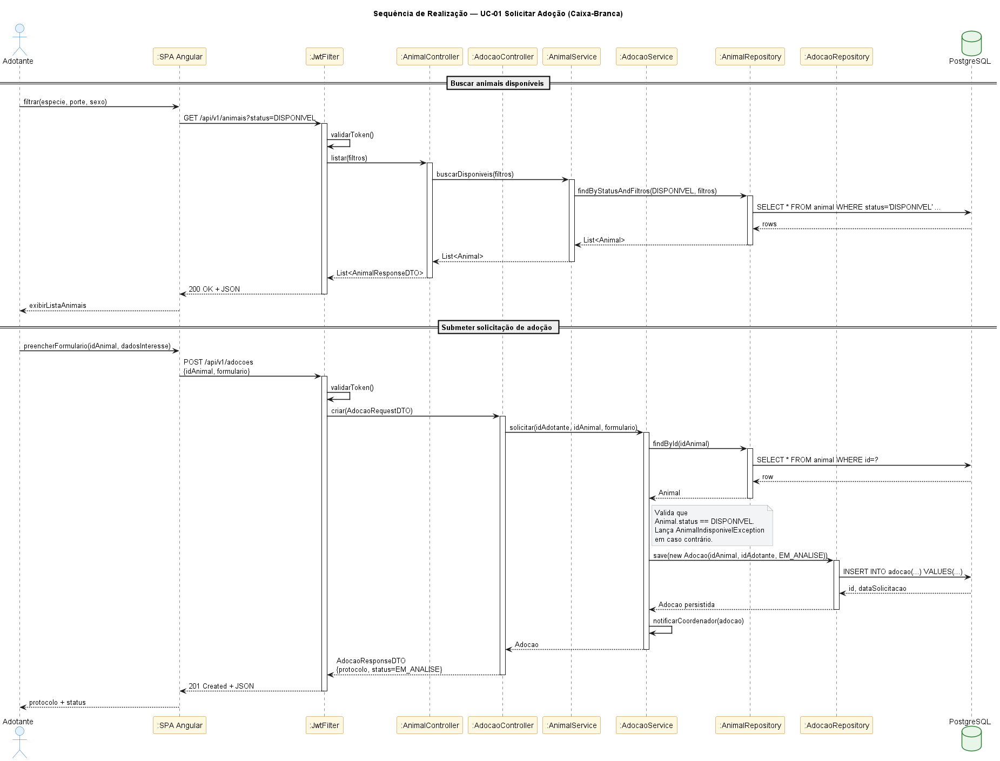 | 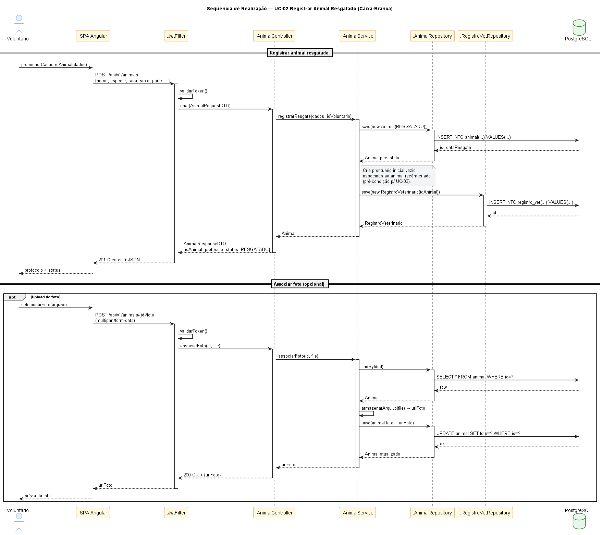 | 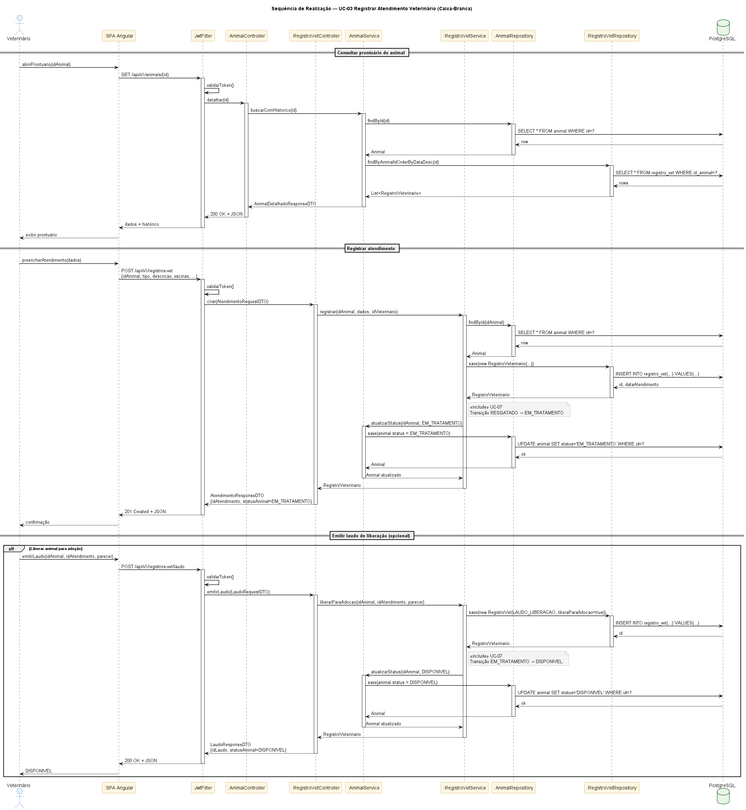 |
| **Figura 10** — Realização UC-01 Solicitar Adoção | **Figura 11** — Realização UC-02 Registrar Animal | **Figura 12** — Realização UC-03 Registrar Atendimento |

**Observações de modelagem:**
- A autenticação é representada pelo passo `validarToken()` em `JwtFilter`, exigido em toda requisição autenticada.
- O UC-03 ilustra explicitamente o relacionamento **«include» UC-07** Atualizar Status do Animal — `RegistroVetService` delega a `AnimalService.atualizarStatus(...)` após registrar o atendimento.
- Validações de regra de negócio (ex.: `Animal.status == DISPONIVEL` antes de criar `Adocao`) aparecem como auto-mensagens ou `note right of` no respectivo `Service`.

Fontes PlantUML:
- [`docs/diagrams/puml/10-seq-solicitar-adocao.puml`](docs/diagrams/puml/10-seq-solicitar-adocao.puml)
- [`docs/diagrams/puml/11-seq-registrar-animal.puml`](docs/diagrams/puml/11-seq-registrar-animal.puml)
- [`docs/diagrams/puml/12-seq-registrar-atendimento.puml`](docs/diagrams/puml/12-seq-registrar-atendimento.puml)

---

### 3.5 Diagramas de Comunicação

> Os diagramas de comunicação apresentam **a mesma colaboração** dos diagramas de sequência da seção 3.4, porém vistos como **rede de objetos** com **numeração de mensagens** em vez de eixo temporal vertical. Enquanto o diagrama de sequência destaca a **ordem temporal**, o de comunicação destaca os **vínculos estruturais** entre os objetos participantes.

| Aspecto | Sequência (3.4) | Comunicação (3.5) |
|---|---|---|
| **Foco** | Ordem temporal das mensagens | Vínculos estruturais entre objetos |
| **Layout** | Linhas de vida verticais | Objetos em rede |
| **Ordenação** | Posição vertical | Numeração explícita (`1:`, `2:`, …) |

| UC-01 Solicitar Adoção | UC-02 Registrar Animal | UC-03 Registrar Atendimento |
| :---: | :---: | :---: |
| 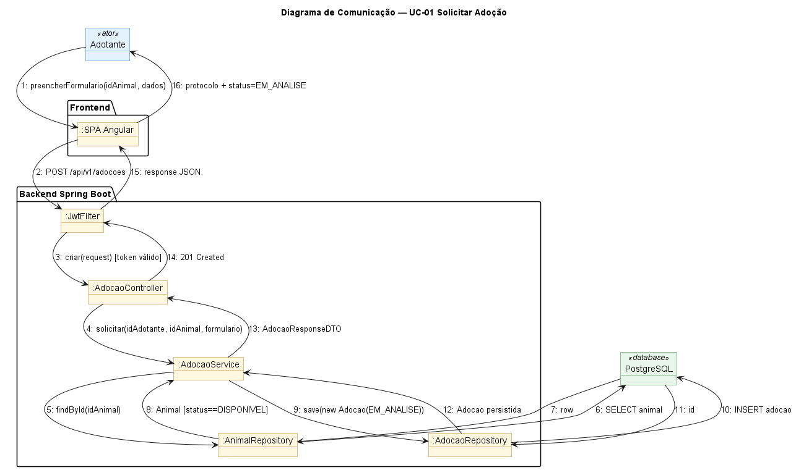 | 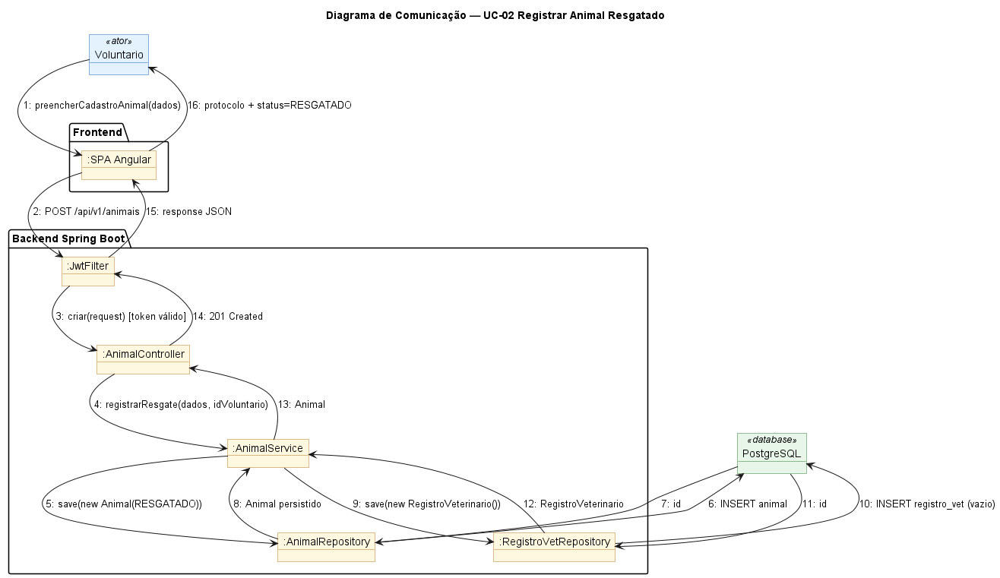 | 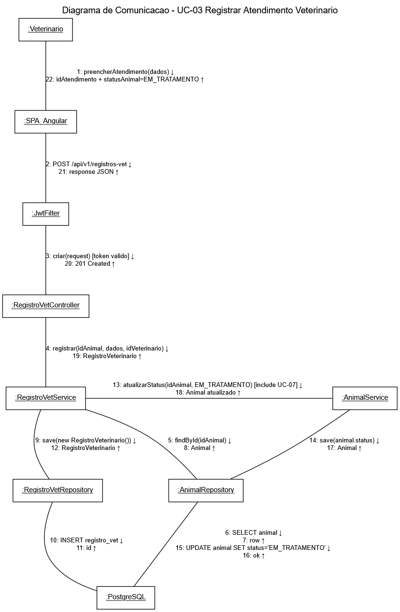 |
| **Figura 13** — Comunicação UC-01 Solicitar Adoção | **Figura 14** — Comunicação UC-02 Registrar Animal | **Figura 15** — Comunicação UC-03 Registrar Atendimento |

Os objetos colaboradores estão agrupados visualmente em pacotes (`Frontend`, `Backend Spring Boot`) e o `PostgreSQL` aparece como banco externo. Para o UC-03, o diagrama de comunicação modela apenas a operação principal (`registrarAtendimento`) — o fluxo alternativo de emissão de laudo é coberto no diagrama de sequência (Figura 12).

Fontes PlantUML:
- [`docs/diagrams/puml/13-com-solicitar-adocao.puml`](docs/diagrams/puml/13-com-solicitar-adocao.puml)
- [`docs/diagrams/puml/14-com-registrar-animal.puml`](docs/diagrams/puml/14-com-registrar-animal.puml)
- [`docs/diagrams/puml/15-com-registrar-atendimento.puml`](docs/diagrams/puml/15-com-registrar-atendimento.puml)

---

### 3.6 Diagrama de Estados

> Ciclo de vida de um animal dentro da plataforma, do resgate à adoção. Cada transição é acionada por uma operação de sistema ligada a um caso de uso da seção 2.2 — em particular, todo o eixo principal de mudança de status é coberto por **UC-07 Atualizar Status do Animal**, que aparece como **«include»** nos UCs 03, 09 e 10.

#### Resumo dos estados

| Estado | Significado | Próximo(s) estado(s) típico(s) |
|---|---|---|
| `RESGATADO` | Animal recém-resgatado, aguardando triagem veterinária | `EM_TRATAMENTO`, `OBITO` |
| `EM_TRATAMENTO` | Atendimentos veterinários em andamento (consultas, vacinas, cirurgias) | `EM_TRATAMENTO` (novo atendimento), `DISPONIVEL`, `OBITO` |
| `DISPONIVEL` | Apto à adoção, visível na busca pública (UC-04) | `EM_PROCESSO_ADOCAO`, `OBITO` |
| `EM_PROCESSO_ADOCAO` | Adoção aprovada, aguardando contrato e entrega | `ADOTADO`, `DISPONIVEL`, `OBITO` |
| `ADOTADO` | Adoção concluída, acompanhamento pós-adoção ativo | `DISPONIVEL` (devolução), estado terminal |
| `OBITO` | Animal veio a óbito — estado terminal | — |

#### Principais transições

| De → Para | Evento / Operação | Caso de Uso |
|---|---|---|
| `RESGATADO` → `EM_TRATAMENTO` | Primeiro `registrarAtendimento()` após resgate | UC-03 «include» UC-07 |
| `EM_TRATAMENTO` → `EM_TRATAMENTO` | Novo atendimento (auto-transição) | UC-03 |
| `EM_TRATAMENTO` → `DISPONIVEL` | `emitirLaudoLiberacao()` com `liberaParaAdocao = true` | UC-09 «include» UC-07 |
| `DISPONIVEL` → `EM_PROCESSO_ADOCAO` | `aprovarAdocao()` pelo Coordenador | UC-10 «include» UC-07 |
| `EM_PROCESSO_ADOCAO` → `ADOTADO` | `concluirAdocao()` (contrato assinado) | UC-10 |
| `EM_PROCESSO_ADOCAO` → `DISPONIVEL` | Desistência do adotante ou rejeição | UC-10 |
| `ADOTADO` → `DISPONIVEL` | Devolução do animal (falha no acompanhamento pós-adoção) | UC-06 |
| qualquer → `OBITO` | Óbito clínico do animal | UC-03 |

| 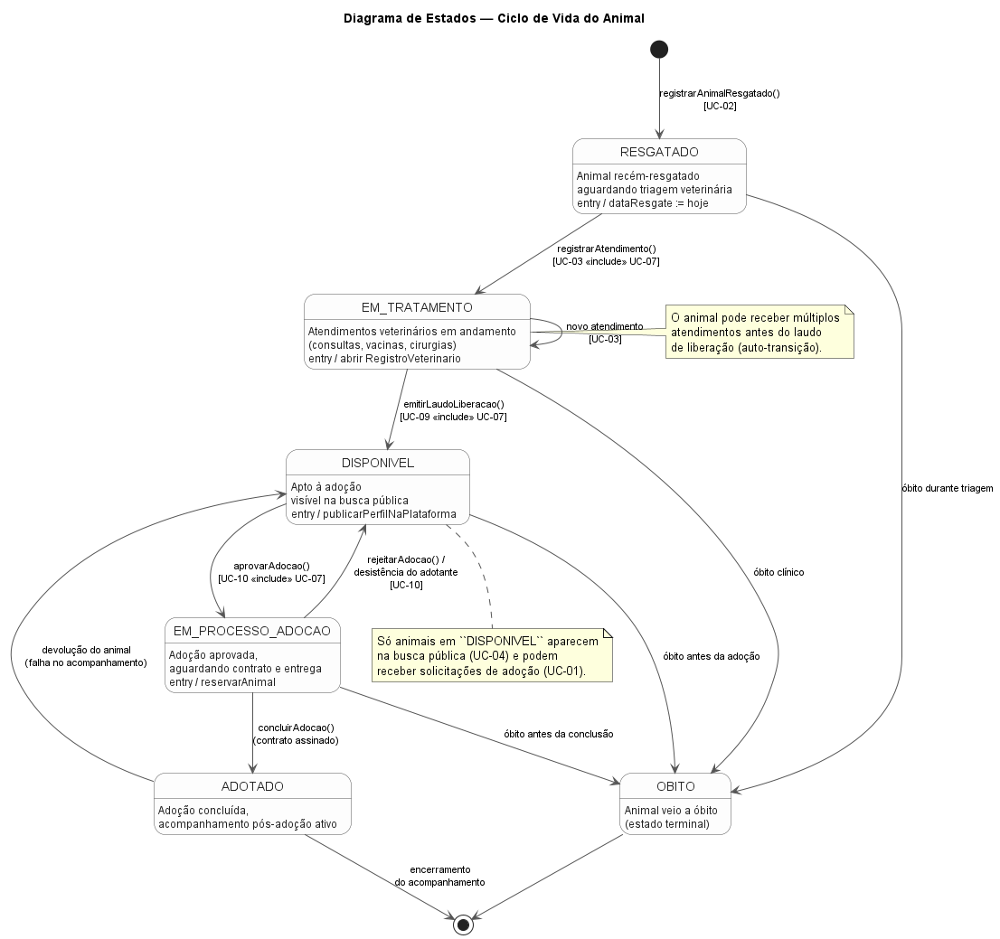 |
| :---: |
| **Figura 16** — Diagrama de Estados: Ciclo de Vida do Animal |

Fonte PlantUML: [`docs/diagrams/puml/16-estado-animal.puml`](docs/diagrams/puml/16-estado-animal.puml)

---

## 4. Modelos de Dados

> Esquema relacional do banco PostgreSQL e a estratégia de mapeamento objeto/relacional adotada (Hibernate/JPA). O modelo lógico espelha o diagrama de classes da seção 3.3, preservando a **Abordagem C** para usuários: tabela `usuario` central e cinco tabelas de perfil opcionais 1:1.

### Diagrama Entidade-Relacionamento

#### Visão geral das tabelas

| Tabela | Cardinalidade com `usuario` | Papel |
|---|:---:|---|
| `usuario` | — | Identidade central; dados pessoais e credenciais |
| `perfil_adotante` | 1 ─ 0..1 | Dados específicos do papel Adotante |
| `perfil_doador` | 1 ─ 0..1 | Dados específicos do papel Doador |
| `perfil_voluntario` | 1 ─ 0..1 | Dados específicos do papel Voluntário |
| `perfil_veterinario` | 1 ─ 0..1 | Dados específicos do papel Veterinário (CRMV, especialidade) |
| `perfil_coordenador` | 1 ─ 0..1 | Dados específicos do papel Coordenador |
| `animal` | — | Entidade central do negócio |
| `registro_veterinario` | — | Prontuário; FK para `animal` e `perfil_veterinario` |
| `adocao` | — | Processo de adoção; FKs para `animal`, `perfil_adotante` e `perfil_coordenador` |
| `doacao` | — | Aporte financeiro; FK para `perfil_doador` |
| `relatorio` | — | Saída agregada; FK para `perfil_coordenador` |

> Nas cinco tabelas `perfil_*` a coluna `usuario_id` é **simultaneamente PK e FK** para `usuario(id)` — característica da Abordagem C que garante a cardinalidade 1:1 opcional sem coluna `tipo_perfil` discriminadora e sem herança no banco.

| 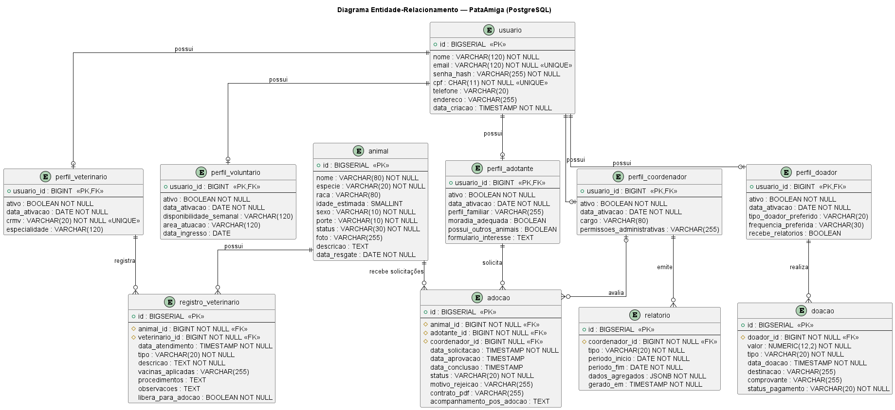 |
| :---: |
| **Figura 17** — Diagrama Entidade-Relacionamento do PataAmiga (PostgreSQL) |

Fonte PlantUML: [`docs/diagrams/puml/17-entidade-relacionamento.puml`](docs/diagrams/puml/17-entidade-relacionamento.puml)

### Estratégia de Mapeamento Objeto-Relacional

O backend usa **Hibernate** como provider JPA. Cada classe do modelo de domínio (seção 3.3) é mapeada para uma tabela PostgreSQL conforme as convenções a seguir.

#### Convenções gerais

| Aspecto | Decisão |
|---|---|
| Nomes de tabelas e colunas | `snake_case` minúsculo (via `Hibernate.physical_naming_strategy = CamelCaseToUnderscoresNamingStrategy`) |
| Chaves primárias | `@Id @GeneratedValue(strategy = GenerationType.IDENTITY)` mapeado para `BIGSERIAL` |
| Enums | `@Enumerated(EnumType.STRING)` — preserva legibilidade no banco e segurança em refatorações |
| Datas/horas | `LocalDate` → `DATE`, `LocalDateTime` → `TIMESTAMP` (JPA 3.1, sem `@Temporal`) |
| Valores monetários | `BigDecimal` → `NUMERIC(12,2)` em `Doacao.valor` |
| Texto longo | Campos como `Adocao.acompanhamentoPosAdocao`, `Animal.descricao` e `RegistroVeterinario.observacoes` usam `@Column(columnDefinition = "TEXT")` |
| JSON estruturado | `Relatorio.dadosAgregados` mapeado como `JSONB` via `@JdbcTypeCode(SqlTypes.JSON)` (Hibernate 6) |
| `equals` / `hashCode` | Baseados apenas no `id` (entidades JPA com identidade gerada) |
| Versionamento | `@Version` em entidades editáveis com concorrência (`Animal`, `Adocao`) para locking otimista |

#### Mapeamento da Abordagem C (Usuario + Perfis)

Cada perfil é uma entidade independente cuja chave primária é **também a chave estrangeira** para `usuario`, materializando o relacionamento 1:1 opcional sem coluna nullable na tabela base.

```java
@Entity
@Table(name = "usuario")
public class Usuario {
    @Id @GeneratedValue(strategy = GenerationType.IDENTITY)
    private Long id;

    @Column(nullable = false, unique = true, length = 120)
    private String email;

    @OneToOne(mappedBy = "usuario", cascade = CascadeType.ALL, orphanRemoval = true,
              fetch = FetchType.LAZY)
    private PerfilAdotante perfilAdotante;
    // ... mesma anotação para os outros 4 perfis
}

@Entity
@Table(name = "perfil_adotante")
public class PerfilAdotante {
    @Id
    private Long id;          // mesmo valor de usuario.id

    @MapsId
    @OneToOne(fetch = FetchType.LAZY)
    @JoinColumn(name = "usuario_id")
    private Usuario usuario;
}
```

- `@MapsId` informa ao Hibernate que a PK do `PerfilAdotante` é derivada da FK para `Usuario` — não há sequência separada.
- O **lado proprietário** do relacionamento é o perfil (ele carrega `usuario_id`); o `Usuario` usa `mappedBy`.
- `cascade = ALL` + `orphanRemoval = true` permitem criar/remover o perfil junto com o usuário quando apropriado.

> **Por que não `@Inheritance`?** Uma hierarquia JPA (`SINGLE_TABLE`, `JOINED` ou `TABLE_PER_CLASS`) exigiria que cada usuário fosse exatamente **um** tipo de perfil. No PataAmiga uma mesma pessoa pode acumular qualquer combinação de papéis (ex.: voluntário que também adota e doa), o que invalida a herança e justifica a Abordagem C com composição.

#### Mapeamento dos principais relacionamentos

| Relacionamento (UML) | Anotações JPA | Coluna FK no banco |
|---|---|---|
| `Animal "1" → "0..*" RegistroVeterinario` | `@OneToMany(mappedBy = "animal", cascade = ALL, orphanRemoval = true)` em `Animal`; `@ManyToOne @JoinColumn(name = "animal_id")` em `RegistroVeterinario` | `registro_veterinario.animal_id` |
| `PerfilVeterinario "1" → "0..*" RegistroVeterinario` | `@ManyToOne(fetch = LAZY) @JoinColumn(name = "veterinario_id")` em `RegistroVeterinario` | `registro_veterinario.veterinario_id` |
| `Animal "1" → "0..*" Adocao` | `@OneToMany(mappedBy = "animal")` em `Animal`; `@ManyToOne @JoinColumn(name = "animal_id")` em `Adocao` | `adocao.animal_id` |
| `PerfilAdotante "1" → "0..*" Adocao` | `@ManyToOne @JoinColumn(name = "adotante_id")` em `Adocao` | `adocao.adotante_id` |
| `PerfilCoordenador "0..1" → "0..*" Adocao` | `@ManyToOne(optional = true) @JoinColumn(name = "coordenador_id")` em `Adocao` | `adocao.coordenador_id` (nullable) |
| `PerfilDoador "1" → "0..*" Doacao` | `@ManyToOne @JoinColumn(name = "doador_id")` em `Doacao` | `doacao.doador_id` |
| `PerfilCoordenador "1" → "0..*" Relatorio` | `@ManyToOne @JoinColumn(name = "coordenador_id")` em `Relatorio` | `relatorio.coordenador_id` |

#### Estratégias de busca (`FetchType`) e cascata

- **Default = `LAZY`** em todos os `@ManyToOne` e `@OneToOne` — coleções e referências só são carregadas sob demanda, evitando o N+1. Quando uma view precisa de joins, a camada `Service` usa `@EntityGraph` ou JPQL com `JOIN FETCH`.
- **`CascadeType.ALL` + `orphanRemoval = true`** apenas onde a composição é exclusiva: `Usuario → Perfil*`, `Animal → RegistroVeterinario`. Nas demais relações usa-se `CascadeType.PERSIST` ou nenhuma cascata, evitando exclusões em cadeia indesejadas.

#### Versionamento de schema

Migrations versionadas com **Flyway** (`db/migration/V<ts>__<descricao>.sql`). O Hibernate roda em modo `ddl-auto=validate` em produção — o schema é construído exclusivamente pelas migrations, e a aplicação apenas valida na inicialização. Isso garante que o ER documentado nesta seção corresponde ao banco real.

---

## Instalação e Execução

### Pré-requisitos

- **Java JDK 21** ou superior
- **Node.js** LTS (v18 ou superior) + **Angular CLI** (`npm install -g @angular/cli`)
- **Docker** e **Docker Compose**

### Execução com Docker Compose

```bash
git clone https://github.com/RenatoDNS/PataAmiga.git
cd PataAmiga
docker-compose up --build -d
```

Acesse em: `http://localhost:4200` (frontend) e `http://localhost:8080/api` (backend)

### Execução Manual

```bash
# Backend
cd backend
./mvnw spring-boot:run

# Frontend (outro terminal)
cd frontend
npm install
ng serve
```

### Variáveis de Ambiente

| Variável | Descrição | Padrão |
|----------|-----------|--------|
| `SPRING_DATASOURCE_URL` | URL do PostgreSQL | `jdbc:postgresql://localhost:5432/pataamiga` |
| `SPRING_DATASOURCE_USERNAME` | Usuário do banco | `postgres` |
| `SPRING_DATASOURCE_PASSWORD` | Senha do banco | — |
| `JWT_SECRET` | Chave de assinatura JWT | — |
| `apiUrl` (environment.ts) | URL base da API | `http://localhost:8080/api` |

---

## Estrutura de Pastas

```
PataAmiga/
├── .github/
│   └── workflows/              # CI/CD com GitHub Actions
├── docs/
│   └── diagrams/
│       ├── puml/               # Fontes PlantUML (17 diagramas)
│       └── png/                # Imagens geradas dos diagramas
├── backend/                    # API Spring Boot (Java 21)
│   └── src/main/java/
│       └── br/pucminas/pataamiga/
│           ├── controller/     # @RestController — endpoints REST
│           ├── service/        # @Service — regras de negócio
│           ├── repository/     # Spring Data JPA
│           ├── model/          # @Entity — entidades JPA
│           ├── dto/
│           │   ├── request/    # payloads de entrada
│           │   └── response/   # payloads de saída
│           ├── mapper/         # MapStruct — DTO ↔ Entity
│           ├── exception/      # exceptions + @RestControllerAdvice
│           ├── config/         # SecurityConfig, OpenApiConfig, CorsConfig
│           └── security/       # JwtFilter, JwtUtil, UserDetailsServiceImpl
├── frontend/                   # SPA Angular 17 + TypeScript
│   └── src/app/
│       ├── core/               # Guards, interceptors, serviços singleton
│       ├── shared/             # Componentes e pipes reutilizáveis
│       ├── features/           # Módulos por funcionalidade
│       │   ├── animal/
│       │   ├── adocao/
│       │   ├── veterinario/
│       │   └── doador/
│       └── layout/             # Header, footer, navegação
├── docker-compose.yml
├── LICENSE
└── README.md
```

---

## Documentações Utilizadas

- [PlantUML — Documentação Oficial](https://plantuml.com)
- [PlantUML Language Reference Guide (PDF)](https://plantuml.com/guide)
- [Spring Boot — Referência](https://docs.spring.io/spring-boot/docs/current/reference/html/)
- [Angular — Documentação Oficial](https://angular.dev)
- [MapStruct — Referência](https://mapstruct.org/documentation/stable/reference/html/)
- [Docker — Documentação de Referência](https://docs.docker.com/)
- [Conventional Commits](https://www.conventionalcommits.org/en/v1.0.0/)

---

## Autores

| Nome | GitHub | LinkedIn |
|------|--------|----------|
| Renato Douglas | [RenatoDNS](https://github.com/RenatoDNS) | [renatodns](https://www.linkedin.com/in/renatodns/) |

---

## Agradecimentos

- [**Engenharia de Software PUC Minas**](https://www.instagram.com/engsoftwarepucminas/) — Pelo suporte institucional e estrutura acadêmica
- [**Prof. Dr. João Paulo Aramuni**](https://github.com/joaopauloaramuni) — Pelos ensinamentos em Arquitetura de Software e Padrões de Projeto

---

## Licença

Este projeto é distribuído sob a [Licença MIT](./LICENSE).
